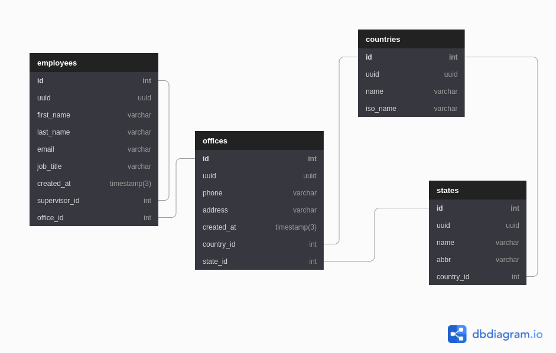

<p align="center" style="background-color:white">
 <a href="https://www.ravn.co/" rel="noopener">
 </a>
</p>
<p align="center">
 <a href="https://www.postgresql.org/" rel="noopener">
 </a>
</p>

---

<p align="center">A project to show off your skills on databases & SQL using a real database</p>

## 📝 Table of Contents

- [Case](#case)
- [Installation](#installation)
- [Data Recovery](#data_recovery)
- [Excersises](#excersises)

## 🤓 Case <a name = "case"></a>

As a developer and expert on SQL, you were contacted by a company that needs your help to manage their database which runs on PostgreSQL. The database provided contains four entities: Employee, Office, Countries and States. The company has different headquarters in various places around the world, in turn, each headquarters has a group of employees of which it is hierarchically organized and each employee may have a supervisor. You are also provided with the following Entity Relationship Diagram (ERD)

#### ERD - Diagram <br>

 <br>

---

## 🛠️ Docker Installation <a name = "installation"></a>

1. Install [docker](https://docs.docker.com/engine/install/)

---

## 📚 Recover the data to your machine <a name = "data_recovery"></a>

Open your terminal and run the follows commands:

1. This will create a container for postgresql:

```
docker run --name nerdery-container -e POSTGRES_PASSWORD=password123 -p 5432:5432 -d --rm postgres:15.2
```

2. Now, we access the container:

```
docker exec -it -u postgres nerdery-container psql
```

3. Create the database:

```
create database nerdery_challenge;
```

4. Restore de postgres backup file

```
cat /.../dump.sql | docker exec -i nerdery-container psql -U postgres -d nerdery_challenge
```

- Note: The `...` mean the location where the src folder is located on your computer
- Your data is now on your database to use for the challenge

---

## 📊 Excersises <a name = "excersises"></a>

Now it's your turn to write SQL queries to achieve the following results (You need to write the query in the section `Your query here` on each question):

1. Total number of accounts.

```
Your query here
```


2. How many users with at least one 2 `CURRENT_ACCOUNT`.

```
Your query here
```


3. List the top five accounts with more amount.

```
Your query here
```


4. Get the three users with the most value after making movements.

```
Your query here
```


5. In this part you need to create a transaction with the following steps:

    a. First, get the ammount for the account `3b79e403-c788-495a-a8ca-86ad7643afaf` after all their movements.
    b. Add a new movement with the information:
        type: IN
        mount: 50.75

    c. Add a new movement with the information:
        type: OUT
        mount: 731823.56

        * Note: if the account does not have enough money you need to reject this insert and make a rollback for the entire transaction
    
    d. Put your answer here if the transaction fails(YES/NO):
    ```
        Your answer
    ```

    e. If the transaction fails, make the correction on step _c_ to avoid the failure:
    ```
        Your query
    ```

    f. Once the transaction is correct, make a commit
    ```
        Your query
    ```


6. All the movements and the user information with the account `3b79e403-c788-495a-a8ca-86ad7643afaf`

```
Your query here
```


7. The name and email of the user with the highest amount on his/her all accounts

```
Your query here
```


8. Show all the movements for the user `Kaden.Gusikowski@gmail.com` order by account type and created_at on the movements table

```
Your query here
```

